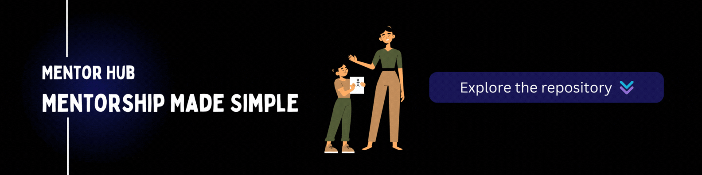
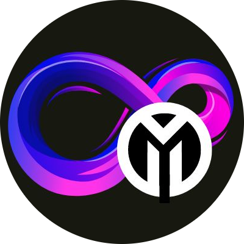

## Overview

[**Mentor Hub**](https://om-ghante-trip-genius.vercel.app/) is a React application that connects mentors with mentees, fostering meaningful relationships. The platform includes a real-time chat feature for seamless communication and guidance, creating a collaborative environment where mentors can support mentees in their growth..

## Technologies Used

- **Frontend**: React.js, Tailwind CSS, Sass, Material Tailwind
- **Database**: Firebase
- **Deployment**: Vercel [frontend](https://om-ghante-trip-genius.vercel.app/), [backend](https://trip-genius-server.vercel.app/)

## Getting Started

To get started with Trip Genius locally, follow these steps:

### Prerequisites

- Node.js and npm installed
- Firebase Application Setup (Auth, Realtime databse, storage, Firestore)

### Installation

1. **Clone the Repository**

   ```bash
   git clone https://github.com/om-ghante/Mentor-Hub.
   ```

2. **Change the work derectory**

   ```bash
   cd Mentor-Hub
   ```

3. **Frontend setup**

   ```bash
   cd client
   npm install
   ```

4. **Configure Environment Variables for fronted**

   ```bash
   VITE_FIREBASE_API_KEY=YOUR_FIREBASE_API_KEY
   VITE_FIREBASE_AUTH_DOMAIN=YOUR_FIREBASE_AUTH_DOMAIN
   VITE_FIREBASE_PROJECT_ID=YOUR_FIREBASE_PROJECT_ID
   VITE_FIREBASE_STORAGE_BUCKET=YOUR_FIREBASE_STORAGE_BUCKET
   VITE_FIREBASE_MESSAGING_SENDER_ID=YOUR_FIREBASE_MESSAGING_SENDER_ID
   VITE_FIREBASE_APP_ID=YOUR_FIREBASE_APP_ID
   VITE_FIREBASE_MEASUREMENT_ID=YOUR_FIREBASE_MEASUREMENT_ID
   ```

5. **Start the Development Servers**

   ```bash
   cd client
   npm run dev
   ```

## Access the Application

Open your web browser and navigate to `http://localhost:${PORT}` to view the Mentor Hub application.

## Contributing
- Contributions are welcome! To contribute to the Mentor Hub project:
- Fork the repository.
- Create a new branch for your feature or fix.
- Make your changes and commit them.
- Open a pull request with a clear description of your updates.

## License
 This project is not licensed under any License.

## Contact
 For any questions or feedback, please contact me at omghante.work@gmail.com


<div align="right">
   
</div